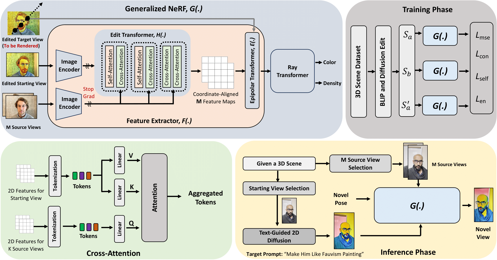
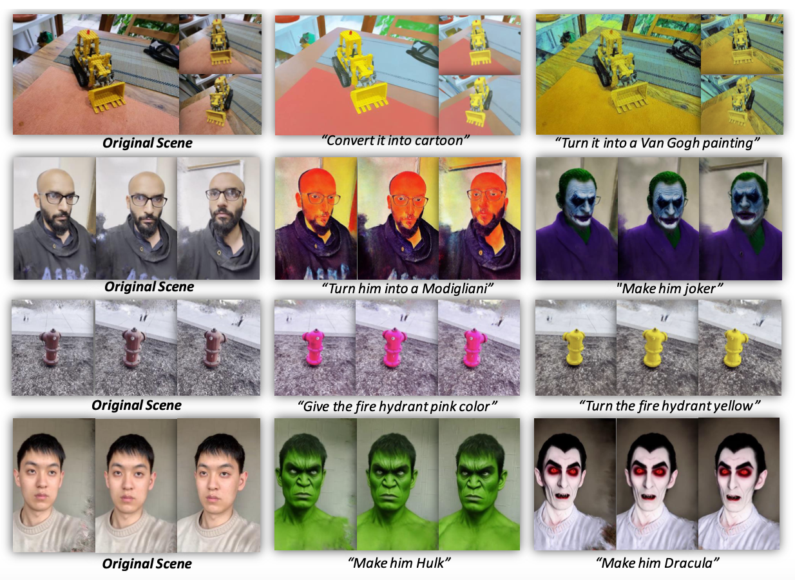

<h2 align="center"> <a href="https://github.com/hasan1292/free-editor">Free-Editor: Zero-shot Text-driven 3D Scene Editing</a></h2>

---

## Highlights

Edit a 3D scene by modifying **just one view**—Free-Editor propagates your change across all camera viewpoints.

* **Training-free:** No per-scene finetuning required.
* **Fast:** \~3 min edit cycle on a modern GPU (prior SOTA ≈70 min).
* **Lightweight workflow:** Load scene → edit a view → apply → render.

---

## Method Overview

<p align="center">
  
</p>

**High-level idea:** We train a generalized NeRF, denoted $G(\cdot)$, that predicts a novel *edited* target view from an *edited starting view* plus $M$ unedited source views of the original scene. The edited target view is **not** provided as an input image at inference; instead, it serves as supervision during training so that $G(\cdot)$ learns how edits should propagate.


## Getting Started

Below is a step-by-step setup tested with Python 3.9, CUDA 11.8, and PyTorch 2.1.2.

> **Tip:** Start in a fresh conda environment to avoid dependency conflicts.

### 1. Create & Activate Environment

```bash
conda create --name nerfstudio -y python=3.9
conda activate nerfstudio
python -m pip install --upgrade pip
```

### 2. Clean Conflicting Installs (if upgrading)

```bash
pip uninstall -y torch torchvision functorch tinycudann
```

### 3. Install CUDA 11.8 Toolkit

```bash
conda install -c "nvidia/label/cuda-11.8.0" cuda-toolkit
```

### 4. Install PyTorch 2.1.2 (CUDA 11.8 wheels)

```bash
pip install torch==2.1.2+cu118 torchvision==0.16.2+cu118 --extra-index-url https://download.pytorch.org/whl/cu118
```

### 5. tiny-cuda-nn Torch Bindings & Ninja

```bash
pip install ninja git+https://github.com/NVlabs/tiny-cuda-nn/#subdirectory=bindings/torch
```

---

## Nerfstudio Installation

Free-Editor builds on Nerfstudio tooling; you can install from PyPI or from source.

### Option A – Quick (PyPI)

> May not work reliably on some clusters. Use source install if you hit issues.

```bash
pip install nerfstudio
```

### Option B – From Source (recommended if you need latest features)

```bash
git clone https://github.com/nerfstudio-project/nerfstudio.git
cd nerfstudio
pip install --upgrade pip setuptools
pip install -e .
```

If you encounter import errors (e.g., `configobj` or others), install missing deps manually:

```bash
git clone https://github.com/DiffSK/configobj.git
cd configobj
python setup.py install
```

---

## Quick Smoke Test (Poster Scene)

Download a small test capture and launch training to verify the toolchain.

```bash
ns-download-data nerfstudio --capture-name=poster
ns-train nerfacto --data data/nerfstudio/poster
```

If training logs start streaming without errors, your environment is good to go.

---

## ImageMagick (Some Datasets Need It)

```bash
cd ~
wget https://download.imagemagick.org/ImageMagick/download/ImageMagick.tar.gz
tar -xvzf ImageMagick.tar.gz
cd ImageMagick-*
./configure --prefix=$HOME/imagemagick
make
make install
```

> Depending on your system, you may need additional build packages (e.g., `libpng`, `libjpeg`, `zlib` dev headers).

---

## Data & Pretrained Resources

Below are useful sources for scene data commonly used with NeRF-style pipelines and Free-Editor experiments.

### RealEstate10K Subset (Hugging Face)

Browse scenes, camera files, and extracted frames:
[https://huggingface.co/datasets/yangtaointernship/RealEstate10K-subset/tree/main](https://huggingface.co/datasets/yangtaointernship/RealEstate10K-subset/tree/main)

**Notes:**

* `synthetic_scenes.zip` corresponds to DeepVoxels-like synthetic content.
* `nerf_synthetic` / Blender-style assets are similar to common NeRF synthetic benchmarks.
* `frames.zip` contains extracted RGB frames for \~200 RealEstate10K scenes; `train.zip` includes camera metadata.

### Shiny Dataset

High-specular multi-view captures: [https://nex-mpi.github.io/](https://nex-mpi.github.io/)

### Spaces Dataset

```bash
git clone https://github.com/augmentedperception/spaces_dataset
```

---

## NeRFbaselines (Optional)

If you want to explore baselines or download benchmark scenes:

```bash
conda deactivate
conda create --name nerfbase -y python=3.9
conda activate nerfbase
pip install nerfbaselines
```

### Sample Downloads

Create a data root:

```bash
mkdir -p data/nerf_dataset
cd data/nerf_dataset
```

Download the MipNeRF360 *garden* scene to cache:

```bash
nerfbaselines download-dataset external://mipnerf360/garden
```

Download **all** Nerfstudio reference scenes:

```bash
nerfbaselines download-dataset external://nerfstudio
```

Download the *kitchen* scene to a folder named `kitchen`:

```bash
nerfbaselines download-dataset external://mipnerf360/kitchen -o kitchen
```

---

## Caption Generation Model (BLIP / BLIP2)

Clone the BLIP2 model checkpoint (large):

```bash
git clone https://huggingface.co/Salesforce/blip2-opt-2.7b
```

Use a smaller captioning model from code:

```python
from transformers import BlipProcessor, BlipForConditionalGeneration

processor = BlipProcessor.from_pretrained("Salesforce/blip-image-captioning-base")
model = BlipForConditionalGeneration.from_pretrained("Salesforce/blip-image-captioning-base")
```

---

## Diffusion Backends

Free-Editor relies on text-to-image editing to produce the **edited starting view**.

### Stable Diffusion 3 Medium (reference)

Fast & accurate model, though current community tooling may not support edit operations directly.

```bash
git clone https://huggingface.co/stabilityai/stable-diffusion-3-medium
```

### Stable Diffusion v1.5 (editing-friendly)

If not downloaded already, authenticate with Hugging Face and let downstream scripts pull the model:

```bash
huggingface-cli login
```

Follow the prompts to paste your access token.

---

## Free-Editor Dataset Generation

Generate training data (edit propagation supervision) for Free-Editor:

```bash
python src/fedit/dataset_creation.py
```

Customize dataset paths, edit prompts, and view sampling in the script or via CLI args (see inline comments).

---

## Free-Editor Training

```bash
python train.py
```

Check `configs/` (if provided) for hyperparameters such as number of source views (M), edit strength weighting, and transformer depth.

---

## 3D Editing Results

### Qualitative Comparisons

<p align="center">
  
</p>

---

## Acknowledgments

This project builds on an incredible open-source ecosystem. Huge thanks to the authors and contributors of the following (and many more):

* [InstructPix2Pix](https://github.com/timothybrooks/instruct-pix2pix)
* [Instruct-NeRF2NeRF](https://github.com/ayaanzhaque/instruct-nerf2nerf)
* [Diffusers](https://github.com/huggingface/diffusers)


---

**Questions?** Open an issue or start a discussion in the repo.
